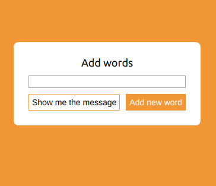
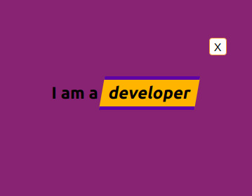

## Let's boost up our ego! 
Live preview: 
https://react-interactive-text-paulina.netlify.app/

Write some **nice** words words about yourself, click on the show button and watch the words about you being displayed one for every second.

You can close the message with the "X" button and start from the beggining.

This project was bootstrapped with [Create React App](https://github.com/facebook/create-react-app).

To run this project on your maschine remember to get the necessary dependencies with `npm install` in the project directory and use the available scripts below:

## Available Scripts

In the project directory, you can run:

### `npm start`

Runs the app in the development mode. 
Open [http://localhost:3000](http://localhost:3000) to view it in the browser.

The page will reload if you make edits. 
You will also see any lint errors in the console.

### `npm test`

Launches the test runner in the interactive watch mode. 
See the section about [running tests](https://facebook.github.io/create-react-app/docs/running-tests) for more information.

### `npm run build`

Builds the app for production to the `build` folder. 
It correctly bundles React in production mode and optimizes the build for the best performance.

The build is minified and the filenames include the hashes. 
Your app is ready to be deployed!

See the section about [deployment](https://facebook.github.io/create-react-app/docs/deployment) for more information.
ady for it.
